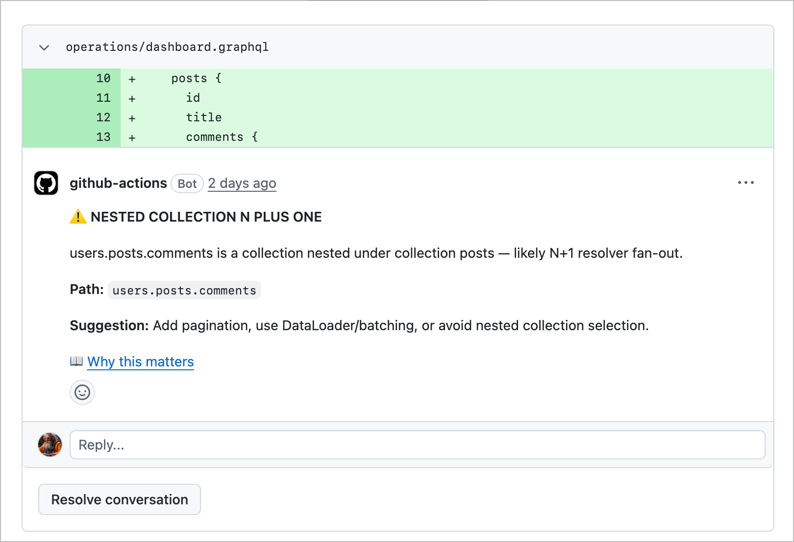

# 🚑 GraphQL Painkiller

> Catch GraphQL performance issues in PRs before they hit production.

**GraphQL Painkiller** is a static analysis tool that scans your queries and schema to detect:
- N+1 risks
- over-fetching
- inefficient resolver patterns

No runtime overhead.  
No AI guesswork.  
No surprises in production.

---



## 🧠 Why this exists

If you’ve worked on a real GraphQL API, you’ve seen it:

- Queries that look harmless… until they hit production
- Nested fields quietly triggering N+1 explosions
- Performance issues discovered *after* deployment

Most tools catch this **too late**.

GraphQL Painkiller runs **at PR time**, so you catch problems before they merge.

📹 [Watch the demo](https://cleanshot.com/share/cPD0D2tz)

---

## ⚡ What it does

Run it against your GraphQL queries or codebase and get actionable feedback:

```bash
❌ Potential N+1 detected: posts.comments
   → Resolver likely executed per parent node
   → Suggestion: batch with DataLoader

⚠️ Over-fetching detected
   → Field "user.profile.bio" not used downstream
```

✅ Query complexity within safe threshold

---

## 🔥 Why not just use AI?

Tools like GitHub Copilot or LLM-based reviewers are great for writing code.

They are not reliable for enforcing performance rules.

GraphQL Painkiller is:

- deterministic
- fast
- consistent
- zero token cost

  AI helps you write code.
  This makes sure it doesn’t hurt you later.

---

## 🚀 Quick Start

### Install

**Prebuilt binaries (recommended)**

Grab the archive for your OS/arch from the [latest release](https://github.com/olddognewflex/GraphQL-PainKiller/releases/latest), extract, and put `gql-painkiller` on your `PATH`. Builds for linux/darwin/windows × amd64/arm64.

**go install**

```bash
go install github.com/olddognewflex/graphql-painkiller/cmd/gql-painkiller@latest
```

**Build locally**

```bash
git clone git@github.com:olddognewflex/GraphQL-PainKiller.git
cd GraphQL-PainKiller
go build -o gql-painkiller ./cmd/gql-painkiller
```

### Run

```bash
gql-painkiller analyze ./src
```

or target specific files:

```bash
gql-painkiller analyze ./queries/**/*.graphql
```

---

## 🔁 GitHub Action (PR Analysis)

Add this to your workflow:

```yaml
name: GraphQL Painkiller

on:
  pull_request:
    paths:
      - "**/*.graphql"
      - "**/*.gql"
      - "**/*.ts"
      - "**/*.tsx"
      - "gql-painkiller.config.yaml"
      - ".github/workflows/graphql-painkiller.yml"
jobs:
  analyze:
    runs-on: ubuntu-latest
    permissions:
      contents: read
      pull-requests: write
    steps:
      - uses: actions/checkout@v3
      - name: Set up Go
        uses: actions/setup-go@v5
        with:
          go-version: '1.22'
      - name: Run GraphQL PainKiller
        run: |
          go install github.com/olddognewflex/graphql-painkiller/cmd/gql-painkiller@latest
          export PATH=$PATH:$(go env GOPATH)/bin
          gql-painkiller post-pr-comments ./src \
            --config ./app/gql-painkiller.config.yaml \
            --fail-on=high
        env:
          GITHUB_TOKEN: ${{ secrets.GITHUB_TOKEN }}
```

---

## 🧩 What it looks for (V1)

- N+1 query patterns
- Deeply nested selection sets
- Over-fetching (unused fields)
- Resolver anti-patterns (basic heuristics)

  This is intentionally focused. More rules coming based on real-world usage.

---

## 🎯 Who this is for

- Teams using GraphQL in production
- Staff / senior engineers responsible for performance
- Anyone tired of debugging “why is this slow?” after deploy

---

## ❌ Who this is NOT for

- Learning GraphQL for the first time
- Tiny projects with minimal data complexity
- People who enjoy production incidents (no judgment)


---

## 🛣️ Roadmap
 - [ ] Configurable rules
 - [ ] Custom org-level policies
 - [ ] Schema-aware analysis
 - [ ] DataLoader detection improvements
 - [ ] CI annotations with deeper context

---

## 💰 Pricing

V1 is free while we validate.

Planned:

- Free tier → basic checks
- Paid → advanced rules, team configs, deeper analysis

If this saves you from one production issue, it pays for itself.

👉 [Get Painkiller Pro](https://buy.stripe.com/cNifZj9h67pJ5o1epf5Ne00)

---

## 🧪 Contributing / Feedback

This tool is being built in the open.

If you:

- hit false positives
- have real-world edge cases
- want custom rules

Open an issue or reach out.

---

## 🧠 Philosophy

GraphQL is powerful—but easy to misuse.

The goal isn’t to block developers.
It’s to **catch problems early without slowing anyone down.**

---

## ⚠️ Disclaimer

This is static analysis. It won’t catch everything.

But it will catch the stuff that bites teams over and over again.

---

## 👀 Example Use Case

Before:

```qraphql
query {
  posts {
    id
    comments {
      id
      author {
        name
      }
    }
  }
}
```

Looks fine… until:

- each comments resolver fires independently
- each author resolver fires independently

After running Painkiller:

```markdown
⚠️ NESTED COLLECTION N PLUS ONE

`posts.comments` is a collection nested under collection posts — likely N+1 resolver fan-out.

**Path**: `posts.comments`

**Suggestion**: Add pagination, use DataLoader/batching, or avoid nested collection selection.

📖 (Why this matters)[https://www.graphql-js.org/docs/n1-dataloader/]
```

## ⭐ If this is useful

Star the repo.
Share it with your team.
Or better yet—try to break it.
